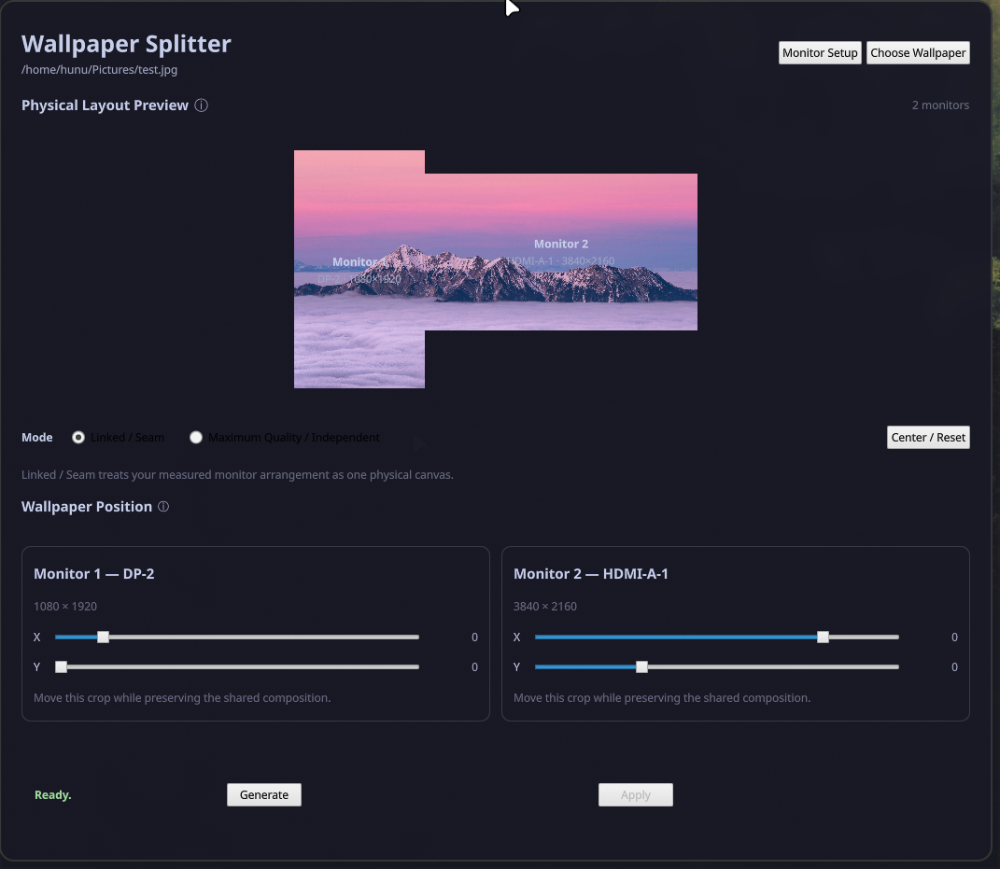
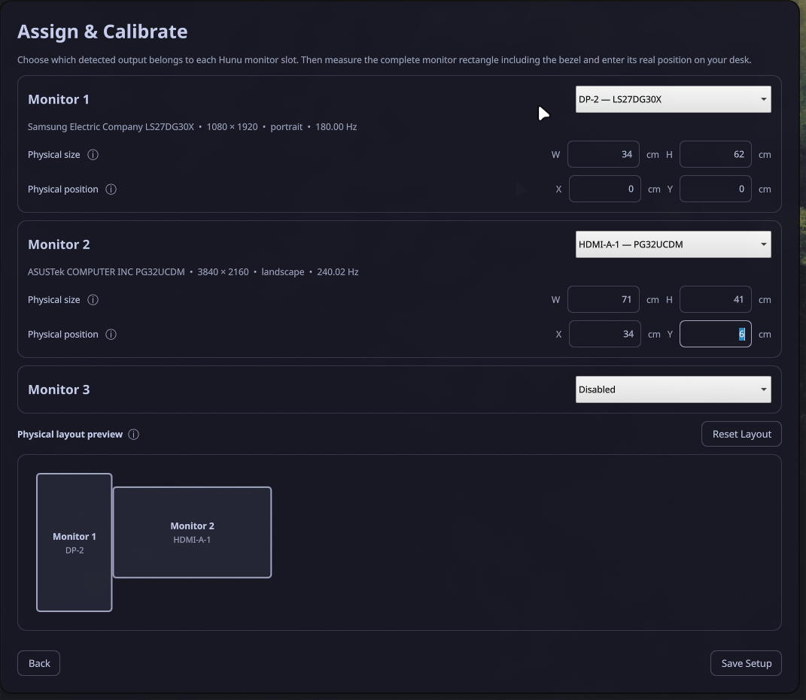

# Hunu Wallpaper Splitter

**Hunu Wallpaper Splitter** is a Hyprland + Quickshell application for creating
coordinated wallpapers across **one to three monitors**.

Instead of assuming that every display has the same size, orientation, or pixel
density, Hunu Wallpaper Splitter can use each monitor's **real physical
dimensions and placement** to build a composition that visually continues
across the displays.

## Preview



Create and preview coordinated wallpapers using the physical arrangement of your monitors.

## Features

- Supports **1–3 monitors**
- Automatically detects connected Hyprland outputs
- Assign any detected output to Monitor 1, 2, or 3
- Configure physical monitor width, height, X position, and Y position in cm
- Supports landscape, portrait, mixed-resolution, and offset monitor layouts
- **Linked / Seam** mode for one physical composition across displays
- **Maximum Quality** mode for independent source crops
- Physical-layout preview
- Wallpaper positioning controls with editable integer fields for exact offsets
- Source-resolution quality analysis with an upscale recommendation
- Optional Real-ESRGAN AI upscaling at 2×, 3×, or 4×
- Readable output sets named from the original image, timestamp, and monitor slot
- Saved monitor setup with first-run configuration
- Optional Apply through Serpantinum, hyprpaper, or awww
- Saved Apply backend selection with live IPC readiness checks
- Optional Serpantinum/Matugen colors with a built-in fallback theme
- XDG-aware installer
- Existing monitor configuration is preserved when reinstalling
- Persistent output-folder chooser
- Generation settings captured at job start, with controls locked while processing
- Reusable AI cache with per-entry locking
- Concurrent generation protected by an output-directory lock
- AI cache size and image count with a Clear AI Cache control
- Live generation stages and available AI upscaling percentages
- Cancel generation with cleanup of unfinished files and child processes
- Scrollable workspace with Generate and Apply kept visible

## Requirements

Required:

- Hyprland
- Quickshell
- ImageMagick (`magick`)
- Bash
- Python 3 (`python3`)
- `awk`
- `jq`
- `flock`
- `sha256sum`
- `timeout`

Optional:

- Serpantinum — optional wallpaper Apply backend and provider of the current
  Serpantinum/Matugen color palette.
- hyprpaper — optional wallpaper Apply backend for Hyprland.
- awww — optional wallpaper Apply backend for compatible Wayland compositors.
- Real-ESRGAN (`realesrgan-ncnn-vulkan`) — enables optional AI upscaling.
  Hunu works normally without it.

Apply requires the selected backend to be running and responding to IPC.
Wallpaper generation works without any Apply backend.

The installer checks dependencies but does not install system packages.

## Install

Clone or download the repository, enter it, and run:

```bash
./install.sh
```

By default the installer uses the standard XDG locations:

- application files: `${XDG_CONFIG_HOME:-$HOME/.config}/hunu-wallpaper`
- desktop launcher: `${XDG_DATA_HOME:-$HOME/.local/share}/applications/`
- icon: `${XDG_DATA_HOME:-$HOME/.local/share}/icons/`
- installer backups: `${XDG_STATE_HOME:-$HOME/.local/state}/hunu-wallpaper/backups/`

An existing installed configuration is backed up before installation. A saved
`config.conf` is preserved across reinstalls.

### Test or alternate installation name

For development or parallel installations, set `HUNU_APP_NAME`:

```bash
HUNU_APP_NAME=hunu-wallpaper-test ./install.sh
```

The application, launcher, icon, and backup paths use that name, keeping the
test installation separate from the normal one. Application names must start
with a letter or number and contain only letters, numbers, dots, underscores,
or hyphens.

## First run

On first launch, Hunu Wallpaper Splitter opens **Monitor Setup**.

For each monitor you want to use:

1. Assign a detected Hyprland output.
2. Confirm its pixel resolution.
3. Enter the monitor's physical width and height in centimeters.
4. Enter its physical X/Y position relative to the other displays.

Physical measurements should include the monitor bezels if you want the linked
composition to account for the real gap occupied by those bezels.

Monitor 1 is required. Monitors 2 and 3 are optional.

After saving, the setup is reused automatically on later launches. Monitor
Setup remains available if the physical arrangement changes.



## Wallpaper modes

### Linked / Seam

Linked mode treats the monitors as windows into one physical composition. It
uses their real-world dimensions and X/Y placement rather than simply joining
their pixel resolutions.

This is useful when a landscape should appear to continue naturally from one
display to another even when the monitors have different sizes, orientations,
resolutions, or vertical offsets.

**Move together** is enabled by default. Changing any monitor's X or Y offset
moves the shared composition across all enabled monitors. Sliders and exact
integer inputs use the movement range valid for every enabled monitor.

Uncheck **Move together** to adjust individual crops. Independent adjustments
can break seam alignment. Re-enabling it synchronizes the monitors to the first
enabled monitor's offsets, limited to the shared valid range.

Maximum Quality mode always keeps monitor positioning independent.

### Maximum Quality

Maximum Quality creates an independent crop from the original source image for
each monitor. This avoids constructing the outputs from one intermediate
combined canvas and prioritizes usable source detail on every display.

## Image quality and AI upscaling

Hunu compares the source image resolution with the resolution needed for the
current monitor layout and wallpaper mode. The Image Quality panel reports
whether the source has enough resolution and, when useful, recommends an
upscale factor.

Upscaling is always optional. Hunu never enables it automatically, even when
the source resolution is below the recommended size.

When `realesrgan-ncnn-vulkan` is installed, the Image Quality panel offers
**Off**, **2×**, **3×**, and **4×** AI upscaling. The original source image is
never modified; the upscaled working image is stored in Hunu's XDG cache.

The `realesrgan-x4plus` model is run at its native 4× scale. For reliable 2×
and 3× output, Hunu creates the native 4× result first and then downsamples it
with ImageMagick to the requested size.

Without Real-ESRGAN, Hunu still analyzes source quality and generates
wallpapers normally from the original image.

Completed AI results are cached by source contents, requested scale, model
name, and helper version. Matching requests reuse the cached image; simultaneous
requests for the same cache entry wait for its creation.

The default cache location is
`${XDG_CACHE_HOME:-$HOME/.cache}/hunu-wallpaper/`. Alternate installations use
their own application-name namespace. Use **Clear AI Cache** to remove reusable
AI images, or uninstall Hunu to remove its cache.

The helper rejects an output that refers to its source file, including through
symlinks or hard links. Results are written to temporary files and replace the
destination only after successful completion. Failed upscaling preserves any
existing destination. AI failures display diagnostic details in the workspace.

## Cache management, progress, and cancellation

Hunu shows the total size and number of reusable AI images. **Clear AI Cache**
removes those cached images while preserving generated wallpapers. Cache
clearing is disabled during processing and refuses to run while another Hunu
generation job holds the cache lock. Small coordination lock files are retained
so running instances continue to synchronize correctly.

Generation displays the current stage. When Real-ESRGAN reports a percentage,
Hunu displays it for the upscaling stage. Wallpaper rendering progress reflects
completed monitor crops; stages without measurable progress use an
indeterminate indicator. Percentages describe the current stage rather than
an estimated percentage of the entire job.

**Cancel** stops the active generation helper and its child processes. Unfinished
working files and incomplete new output sets are cleaned up. Previously
completed wallpapers remain available on disk. A successfully completed AI
cache image may remain reusable if cancellation happens during later rendering.

The upper workspace scrolls when needed, while Generate, Apply, and the results
area remain visible at the bottom.

## Generate and Apply

**Generate** creates the wallpaper files without changing the desktop.

Generated wallpapers are written to:

```text
~/Pictures/Wallpapers
```
**Choose Wallpaper** remembers the folder of the last selected image across
launches and reinstalls. Each installation keeps its own folder preference.

by default. Use **Choose Folder** beside **Save to** to select another existing,
writable directory. The selection is remembered across launches and preserved
when saving monitor calibration. Previously generated wallpapers are left
in their original locations.

Use the sliders for broad positioning adjustments, or type an exact integer
into the X/Y fields. Press Enter or leave the field to apply the value.
Values are limited to the valid crop range. **Center / Reset** returns all
offsets to zero.

Configuration controls are locked while generating or applying wallpapers.
**Cancel** remains available during generation. Generation jobs targeting the
same output directory run sequentially to prevent output-set collisions.

Choose **Serpantinum**, **hyprpaper**, or **awww** from **Apply using**.
The selection is remembered across launches and monitor-setup saves.
Existing configurations without a saved backend default to Serpantinum.

| Backend | Apply method |
| --- | --- |
| Serpantinum | Serpantinum's Quickshell wallpaper IPC |
| hyprpaper | Per-output wallpaper commands through `hyprctl` |
| awww | Per-output image commands through the awww client |

Hunu checks the selected backend's IPC readiness while idle, approximately every
five seconds. The workspace shows its readiness status. Apply is enabled when
a generated set is available and the backend is responding. Each wallpaper is
sent to its assigned monitor output. Switching backends keeps the generated
files available for Apply.

Output filenames use the original image name, a local timestamp, and the monitor
slot suffix `_a`, `_b`, or `_c`. For example:

```text
Mountain-Lake_20261005-140248_a.png
Mountain-Lake_20261005-140248_b.png
```

Spaces and unsupported filename characters become hyphens. The source-name
portion is limited to 100 characters, with `wallpaper` used if it becomes empty.
Same-second naming collisions receive an additional `-02`, `-03`, etc.
AI-generated sets retain the original image name. Existing numbered files are
left untouched.


Hunu does not start or stop wallpaper services. Configure your preferred
backend to start with your desktop session, and use one wallpaper renderer
at a time. For hyprpaper, use a valid startup configuration with a wallpaper
assignment. An empty startup configuration did not keep hyprpaper 0.8.4's IPC
available in testing.

The awww adapter uses stretch resizing and disables transitions when applying
Hunu's finished monitor crops. It does not add a further crop to the generated
composition.

Applying through hyprpaper or awww sets the wallpapers without requesting
Serpantinum/Matugen theme regeneration. Optional Serpantinum theme colors
remain independent of the selected Apply backend.

If no supported wallpaper backend is running, Hunu can still generate files
for use with another wallpaper manager.

## Run manually

With the default installation:

```bash
quickshell -p ~/.config/hunu-wallpaper
```

If `XDG_CONFIG_HOME` or `HUNU_APP_NAME` was customized, use the corresponding
installed application directory instead.

## Uninstall

From the repository:

```bash
./uninstall.sh
```

For an alternate installation name:

```bash
HUNU_APP_NAME=hunu-wallpaper-test ./uninstall.sh
```

The uninstaller removes the installed application, launcher, icon, and Hunu
cache. Generated wallpapers and installer backups are deliberately left
untouched.

## Repository layout

```text
assets/
  hunu-wallpaper.png
config/
  config.example.conf
packaging/
  hunu-wallpaper.desktop
src/
  apply-serpantinum.sh
  apply-wallpapers.sh
  cache-path.sh
  check-apply-backend.sh
  check-monitor-config.sh
  check-upscaler.sh
  detect-monitors.sh
  detect-theme.sh
  load-monitor-config.sh
  manage-cache.sh
  qmldir
  run-generation.py
  save-apply-backend.sh
  save-monitor-config.sh
  save-output-dir.sh
  SetupView.qml
  shell.qml
  split-wallpaper.sh
  upscale-image.sh
  Theme.qml
  WorkspaceView.qml
install.sh
uninstall.sh
README.md
LICENSE
.gitignore
```

`config/config.conf` is a local development configuration and is intentionally
ignored by Git. Public users create their own monitor configuration through the
first-run setup.

## Notes

- Hunu Wallpaper Splitter currently targets **Hyprland + Quickshell**.
- Apply supports Serpantinum, hyprpaper, and awww.
- Broader Apply backend support does not change Hunu's current Hyprland monitor-detection requirement.
- `config.conf` is trusted local Bash configuration and is sourced by the
  configuration helpers.
- Monitor physical placement is user-configured because display protocols do
  not provide the real-world bezel-inclusive arrangement needed for accurate
  seam composition.
- Up to three monitors are supported in the current version.
- Monitor 1/2/3 are configuration slots; physical X/Y placement determines the
  spatial arrangement, so monitor numbering does not need to run left to right.

## License

Hunu Wallpaper Splitter is released under the **MIT License**. See `LICENSE`.
